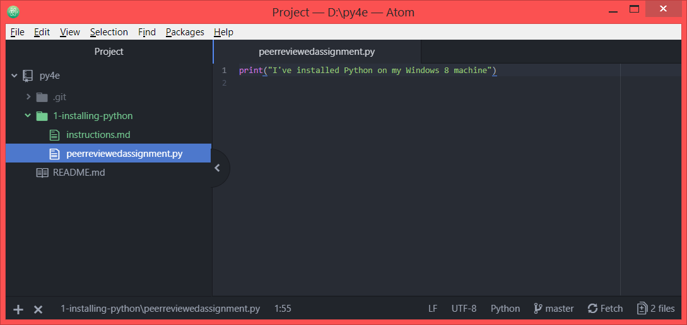
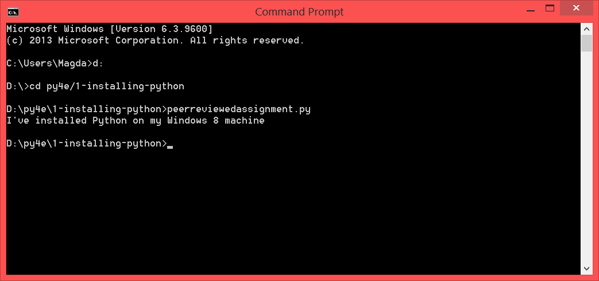

> The first task is to work through the installation steps including installing Python and text editor.

> # Peer Review: Installing and Running Python Screen Shots

> Install Python and a programming text editor and write a program that prints one line other than 'hello world', then take two screen shots and upload them below. You should use the command line to execute the Python program you wrote in the text editor. Please do *not* use the IDLE Python Shell, the Python Interpreter (>>>), or a shortcut in your text editor to run the code. Later in the class when we start reading files, we will need to be able to run Python programs from particular directories. See the videos for details.

> This is a relatively simple assignment. The goal is to simply show that each student has Python installed on their desktop or laptop and can take screen shots. Please make your comments to help the student that you are reviewing.
Assignment specification: http://www.py4e.com/install

Source: https://www.py4e.com/lessons/install

# Results
## Writing a Python program in the Atom text editor
This shows that the text editor has been successfully installed on my Windows 8 machine.

## Running the Python file successfully in Command Prompt
This shows that Python 3 has been successfully installed on my Windows 8 machine, and can run Python files I have written.

