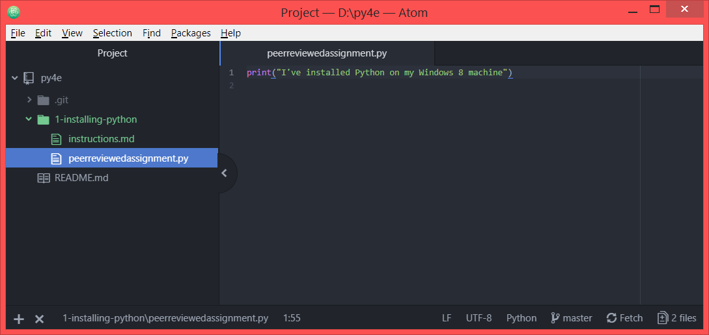

# Results
## Writing a Python program in the Atom text editor
This shows that the text editor has been successfully installed on my Windows 8 machine.

## Running the Python file successfully in Command Prompt
This shows that Python 3 has been successfully installed on my Windows 8 machine, and can run Python files I have written.

